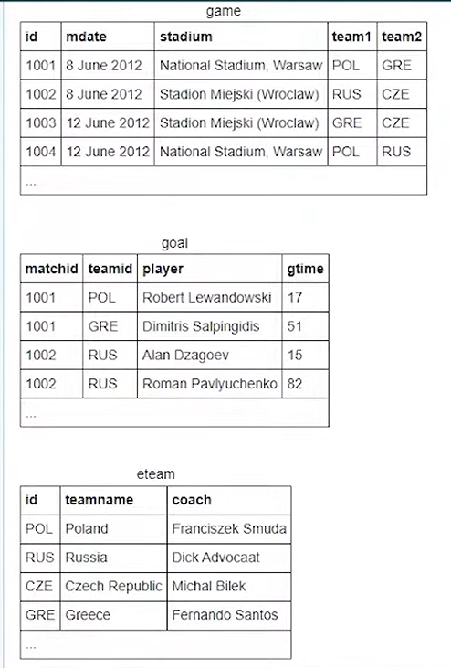
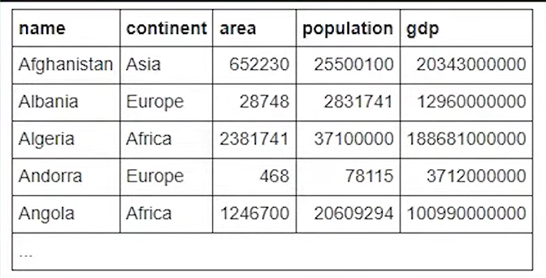
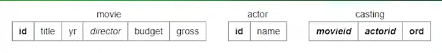

# SQL interview questions

## Non-technical
1. Why do you want this position / why are you good for the role?
> I am a strong team worker / I can be relied upon to carry out technical responsibilities with passion and professionalism / I can help meet the goals of the department

> My level of SQL ability is a good match for the role and I have experience working with other developers and engineers in order to collaborate and complete tasks successfully

2. What is SQL?
> Structured Query Language / standard for managing data stored in relational database management systems

> SQL statements are used to carry out tasks like **updating the data** and **retrieving specific data** from the db

3. Why do you want to work for our company?
> I think it's important to choose your employer carefully. Meaning, in order to carry out your job properly, it's important to work as a team with clearly defined goals and high standards. This will allow you to grow. 

> From my research, you are well thought-of by others in the industry and you have ambitious plans. It's clear you give staff the support they need to grow and contribute to these exciting projects.

4. What is MySQL?
> An open-source relational database management system that is based on SQL. Most commonly used for web databases.

> Utilized by a vriety of database-driven web apps, like WordPress and Joomla, YouTube, Facebook, etc.

> Written in C and C++.

5. Difference between SQL and MySQL?
> SQL is used to **access, manipulate, update data with a database** (It's a language, an abstraction), whereas MySQL is a **relational database management system/tool** (piece of software) that keeps data **organized**. MySQL uses a GUI to define data types, gives users permissions, etc.

> In other words SQL is a langugage used to manage relational databases, and MySQL is an open-source relational database management system, based on SQL.

6. What is your biggest weakness?
> I have found it difficult to say no to people in my past roles. I have gotten into situations where my willingness to agree to many things at a time has led me to need to work all weekend to catch up. I think this highlights my need to learn to manage my workload more effectively, and I think that will come with growth in my role.

7. Do you have any questions for the interviewer?
> If I am successful, what's the first thing you would want me to concentrate on in this position?

## Technical
1. What are `JOINS`?
There are four types of join functions. Joins combine the rows from two or more tables.

- INNER JOINS
    - retrieves records that have matching values in both tables
- OUTER JOINS
    - retrieves records where there is a match in either table
- RIGHT JOINS
    - retrives all records from right table, and if there's a match, also the data from the left table (or blanks if none)
- LEFT JOINS
    - retrives all records from left table, and if there's a match, also the data from the right table (or blanks if none)


2. What is an `INDEX` and why is it useful?
It's useful because it allows for the faster retrieval of records from a table. The index creates an entry for each value (basically a **pointer**), which in turn, makes it faster to retrieve data.

3. What does it mean to add a `constraint` in SQL?
There are many SQL contraints types which can be used. Their purpose is to specify a **rule** for the data within a table, **limiting the type of data that can go in the table**.
They can be added **during the creation of a table** or **after it's created**. Can be applied to whole table or individual columns.

4. What are the common SQL `constraint` types?

- PRIMARY KEY - identifies each record in a table
- NOT NULL - prevents a NULL value from being inserted into column
- FOREIGN KEY - provides a unique ID of a row or record within another table
- DEFAULT - automatically assign a default value if there has not been a value specified for a field
- CHECK - used to verify that all values meet a specific criteria or condition in a field
- UNIQUE - ensures unique values are alwys inserted into a column
- INDEX - used to create data and to obtain it from a database quickly

5. What are `TABLES` and `FIELDS`?
- **Table**: Collection of data that is organized into rows and columns. Columns are vertical, rows are horizontal.

- **Fields**: The columns 

- **Records**: The rows 

6. What are the different subsets of SQL?

There are three main subsets of SQL. 
- Data Control Language (DCL) - permits you to ocntrol access to the db
- Data Definition Language (DDL) - allows you to specify data structures in the database (including deleting/creating/altering tables)
- Data Manipulation Language (DML) - allows you to manipulate data (updating, deleting, retrieving)

7. How would you format SQL server dates?

- The FORMAT function can be used. This function allows the formatting of the data and time.
- For example, DD/MM/YYYY or MM-DD-YY.
- For the first one, I could use:
```
SELECT FORMAT (getdate(), 'dd/MM/yyyy')
```

8. What is PRIMARY and FOREIGN key?

- For a database table to qualify as 'relational', it needs to have a primary key.
- A primary key has one or more columns.
- The data within the columns is then used to identify each row of the table. 
- Basically, very similar to street addresses for example.
- Primary key attributes cannot have NULL values
- A foreign key is a column in one table
- In that table, the values are members of a primary key column in another table.
- It is possible for a foreign key attribute to accept NULL values and for there to be more than one foreign key in a table

9. What is database denormalization?
- A method used to improve the performance of a database, allowing the retrieval of data in the quickest time possible.
- Essentially, denormalization adds redundant database data into a table which in turn enables the performance of the database to improve significantly, as the same data can be put in several places.

10. What is database normalization?
- Reduces redundancy of data within a database.
- A design technique that places larger database tables into smaller tables and then uses specific relationships to link them.
- Normalization is the process of putting each piece of data in the appropriate place, using multiple tables.
- The benefit is keeping data integrity and it makes updating faster
- The downside is that data retrieval can be slower

11. What is a subquery?
- Often referred to as an inner query or inner select.
- It is an SQL query nested inside a larger query, such as a SELECT, UPDATE, or INSERT statement (or inside another subquery)
- A subquery can be used to retrive data that will be used in the main query
- Provides a condition to restrict the retrieval of data even further

12. What happens to the data rows in the table when the table contains a clustered index?
- The data rows will be stored in **order**
- Clustered indexes sort data rows based on their key values
- When a table doesn't use clustered index, this is called a **heap**
- in a **heap**, data rows will be unordered

13. What is a PRIMARY KEY?
A unique, non-nullable identifier for each record in a table. Can be one column or multiple. But each table can only have one primary key.

## Top queries to know

### A JOIN and a WHERE statement

List the player for every goal scored in a game where the stadium was 'National Statium, Warsaw'
```sql
SELECT player
FROM goal go
JOIN game ga ON go.matchid = ga.id
WHERE statdium = 'National Statium, Warsaw'

```

### A GROUP BY statement
table name 'world'

For each continent show the continent and number of countries with populations of at least 10 million.
- since we have a count in the select statement, we need to GROUP BY
- we group by continent, because we want to see the count for each continent
```sql
SELECT continent, count(name) countries
FROM world
WHERE populatio > 10000000
GROUP BY continent
```

### A GROUP BY with HAVING clause to filter our results
table name 'world'

List the continents that **have** a total population of at least 100 million.
```sql
SELECT continent
FROM world
GROUP BY continent
HAVING sum(population) > 100000000
```

### A JOIN, a GROUP BY, and a HAVING clause

Obtain a list, in alphabetical order, of actors who've had at least 15 **starring** roles.
```sql
SELECT name
FROM actor a
JOIN casting c on c.actorid = a.id
WHERE c.ord = 1
GROUP BY name
HAVING count(name) >= 15
```

### Similar to last, with a subquery

List all the poeple who have worked with 'Art Garfunkel'
```sql
SELECT name
FROM actor a
JOIN casting c on c.actorid = a.id
WHERE c.movieid in
(
    SELECT c.movieid
    FROM actor a
    JOIN casting c on c.actorid = a.id
    WHERE a.name = 'Art Garfunkel'
)
AND name != 'Art Garunkel'
```


### Delete duplicate data
```sql

```