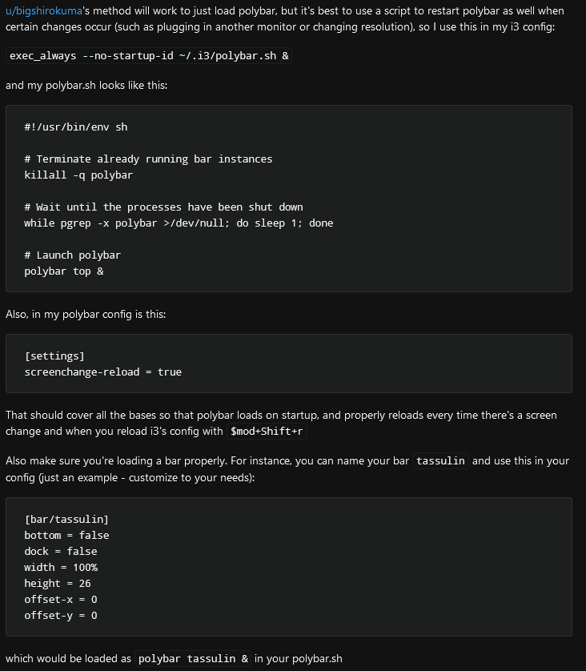

# General Linux notes

## Get IP address of machine
```
ip address
```
or
```
ip a
```
or
```
hostname -I
```

## Screenshot
```
scrot test.png
```

## Image viewer
```
feh test.png
```
### PDF viewer
```
atril some_pdf.pdf
```

## Save installed packages to list on Debian
```
dpkg --get-selections > packages.list
```

## Configure polybar with i3


## Customize lightdm
- modify `/etc/lightdm/lightdm.conf`
- to change the default greeter, make sure it's installed, e.g.
    - `sudo apt install lightdm-gtk-greeter`
- then add it to the `lightdm.conf`:
    ```
    [SeatDefaults]
    greeter-session=lightdm-gtk-greeter
    ```
- then restart lightdm
    - `sudo systemctl restart lightdm`

## X has some energy-saving features
X.org has some basic screen saver functionality as well as energy saving features. Most likely either or both are responsible for the described behavior.

The settings for both can be viewed and changed with the `xset` tool (from the x11-xserver-utils package). `xset q` displays the current settings in the sections Screen Saver and DPMS (Energy Star).

You can disable the screen saver feature with:

`xset s off`

## Time formats
https://en.cppreference.com/w/cpp/io/manip/put_time

## SSH keys: avoid having to enter passphrase

the best way of using ssh

Before using Git add your key to ssh-agent

Start ssh-agent if not started:
```
$ eval `ssh-agent -s`
```

Add your private key using ssh-add
```
$ ssh-add ~/.ssh/id_rsa_key  
Enter passphrase for /home/user/.ssh/id_rsa_key:  
Identity added: /home/user/.ssh/id_rsa_key   
(/home/user/.ssh/id_rsa_key)  
```
Check if the key is added (parameter is a lowercase L):
```
$ ssh-add -l  
2048 55:96:1a:b1:31:f6:f0:6f:d8:a7:49:1a:e5:4c:94:6f  
/home/user/.ssh/id_rsa_key (RSA)
```
Try to connect to your Git server:
```
$ ssh git.example.com
```
Now you can use Git without extra passphrase prompts.
